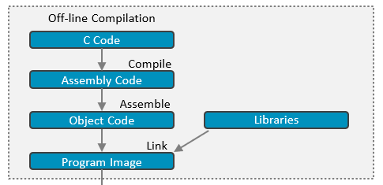
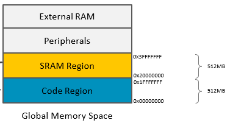
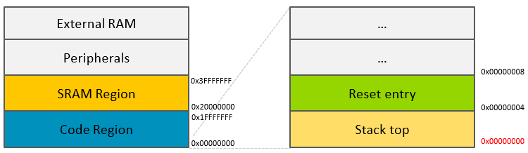

# Introduction

This is the lecture for day1.  In this chapter, we will compile our first application and analyze it.

Supported device

- M0+
- M3
- M4


# Labs

Before you dig, is recommended to read the following material published by ARM education first. It will take you about 1~2 hours to read the above lectures.

[Module01_IntroductionToEmbeddedSystems](https://github.com/arm-university/Rapid-Embedded-Education-Kit/tree/main/ST_Nucleo_F401RE_2020/Contents/Module01_IntroductionToEmbeddedSystems)

[Module02_TheArmCortexM4ProcessorArchitecture](https://github.com/arm-university/Rapid-Embedded-Education-Kit/tree/main/ST_Nucleo_F401RE_2020/Contents/Module02_TheArmCortexM4ProcessorArchitecture)

[Lecture03_IntroductionToArmCortexM4Programming](https://github.com/arm-university/Rapid-Embedded-Education-Kit/blob/main/ST_Nucleo_F401RE_2020/Contents/Module03_IntroductionToArmCortexM4Programming/Lecture03_IntroductionToArmCortexM4Programming.pptx)


## Takeaway

you should know that the compilation is an essential knowledge for programming.



Generally, the memory space layout in Cortex-M base CPU is as follows.



For Cortex-m based CPU, the first word in code region is stack top, while the next is Reset entry which contains the address of the first instruction in an application.




## section 1

Build the project by the following commands (ignore the warnings):

```
arm-none-eabi-as -c start.s -o start.o
arm-none-eabi-ld start.o -Ttext=0 -o example.elf
```


## section 2

solve warning Issue:

In the previous section, we got the following  error when linking

```
warning: cannot find entry symbol _start; defaulting to 00000000
```

create a new linker script called  `link.ld` (already exists)

```
ENTRY(vector_start)
```

specify that the linker flags link to a linker file by  `-Tlink.ld`

```
arm-none-eabi-as -c start.s -o start.o
arm-none-eabi-ld start.o -Tlink.ld -o example.elf
```


## Section 3 (optional)

### Question

There are some questions in `start.s`

```assembly
.thumb                                // Q0
.section .text                        // Q1

.global vector_start                   //Q2
vector_start:
stack_top: .word 0x00000000            //Q3
reset_entry: .word Reset_Handler + 1   //Q4
reserved: .space 0x400                 //Q5

Reset_Handler:                         
    nop     
    b Reset_Handler     //Infinite loop.
```


Q0: what does `.thumb` stands for in assembly code?

Q1: what does `.section .text` stands for in assembly code?

Q2: what does `.global` stands for in assembly code?

Q3: why  do we set stack_top at the 0x00000000 ?

Q4: why the reset entry can be represented by  the address of Reset_handler  plus 1?

Q5: why do we reserve 1k-bytes space after the reset entry?


##  Compiler Flags

Generally, in order to tell the compiler that what type of cpu arch which we program in the project , we may add some flags when compile the code.

```
arm-none-eabi-as -mthumb -mcpu=cortex-m0plus -c start.s -o start.o  # for Cortex-m0+
arm-none-eabi-as -mthumb -mcpu=cortex-m3 -c start.s -o start.o  # for Cortex-m3
arm-none-eabi-as -mthumb -mcpu=cortex-m4 -c start.s -o start.o  # for Cortex-m4
```

