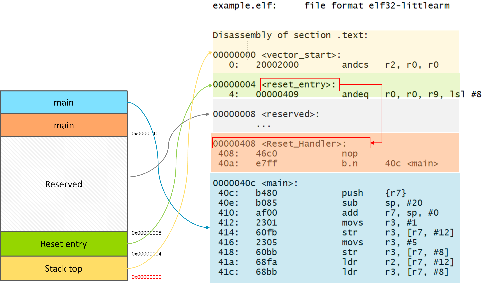

# Introduction


```
arm-none-eabi-as -mthumb -mcpu=cortex-m4 -c start.s -o start.o
arm-none-eabi-gcc -mthumb -mcpu=cortex-m4 -g -c main.c -o main.o
arm-none-eabi-ld start.o main.o -Tlink.ld -o example.elf
```


Analyzing the disassembly code

dump your code:

```
arm-none-eabi-objdump -D  example.elf > dump.txt
```





MSP VS PSP


