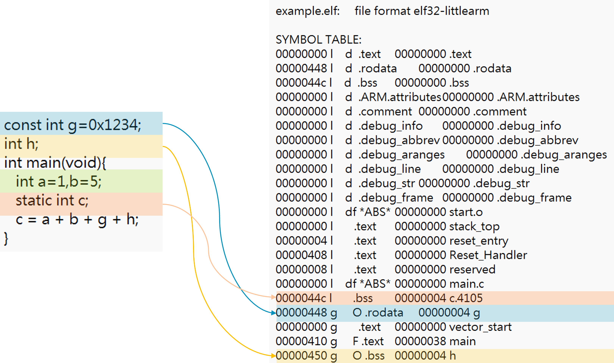
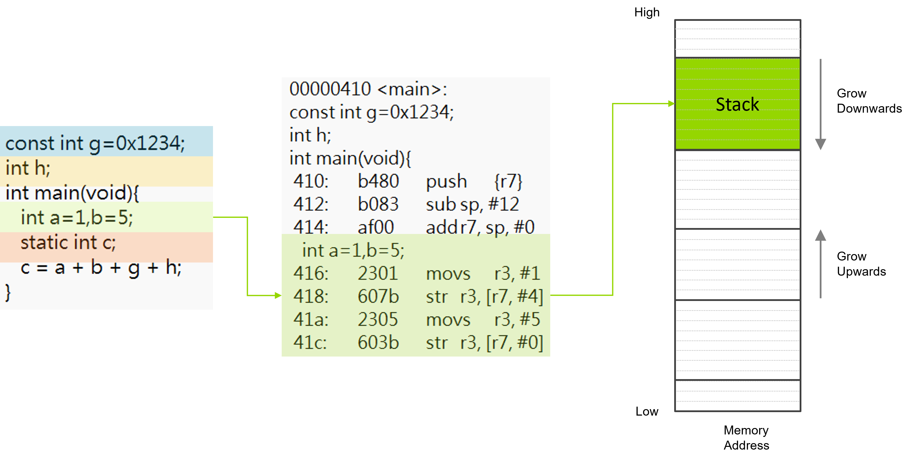
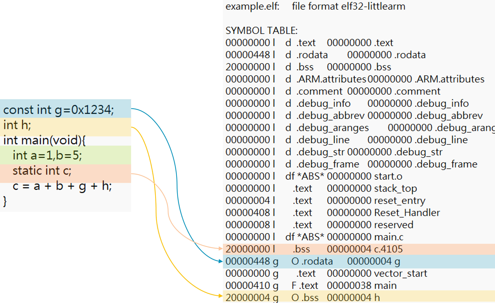
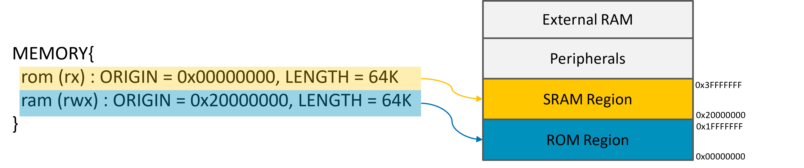
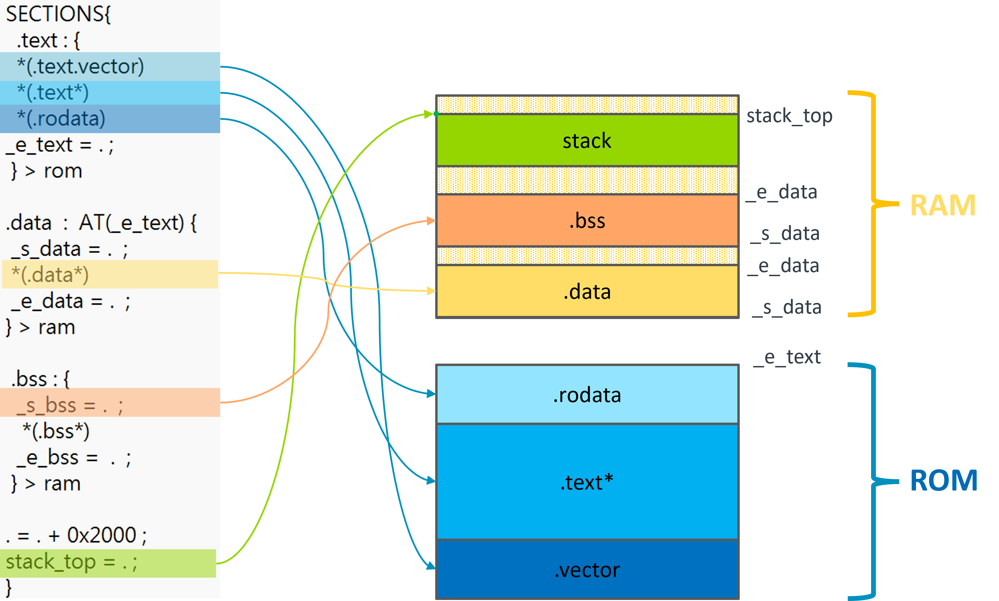

# Introduction


Part 1

```
arm-none-eabi-as -mthumb -mcpu=cortex-m4 -c start.s -o start.o
arm-none-eabi-gcc -mthumb -mcpu=cortex-m4 -g -c main.c -o main.o
arm-none-eabi-ld start.o main.o -Tlink.ld -o example.elf
```


In section 1, we dump the elf file to `dump.txt` in which we check the location of symbols and variables.

```
 arm-none-eabi-objdump -t  example.elf > dump.txt
```




```
 arm-none-eabi-objdump -D -S  example.elf > dump.txt
```





Part 2

In section 2, we create a new linker script `link2.ld` where we specify the location of each section along with the `stack_top`. Next, we build this example by the following commands.

```
arm-none-eabi-as -mthumb -mcpu=cortex-m4 -c start.s -o start2.o
arm-none-eabi-gcc -mthumb -mcpu=cortex-m4 -g -c main.c -o main.o
arm-none-eabi-ld start.o main.o -Tlink2.ld -o example.elf
```


```
arm-none-eabi-objdump -t  example.elf > dump.txt
```




Part 3

linker script







```
.data  :  AT(_e_text) {
 _s_data = .  ;
 *(.data*)
 _e_data = .  ;
} > ram
```


```
arm-none-eabi-gcc -mthumb -mcpu=cortex-m4 -g -c main.c -o main.o
arm-none-eabi-gcc -mthumb -mcpu=cortex-m4 -g -c __main.c -o __main.o
arm-none-eabi-as -mthumb -mcpu=cortex-m4 -c start3.s -o start3.o
arm-none-eabi-ld start3.o main.o __main.o -Tlink3.ld -o example.elf
```


LMA VMA Analysis:


```
arm-none-eabi-objdump -h example.elf > dump.txt
vim dump.txt

example.elf:     file format elf32-littlearm

Sections:
Idx Name          Size      VMA       LMA       File off  Algn
  0 .text         000004ac  00000000  00000000  00010000  2**2
                  CONTENTS, ALLOC, LOAD, READONLY, CODE
  1 .data         00000004  20000000  000004ac  00020000  2**2
                  CONTENTS, ALLOC, LOAD, DATA
  2 .bss          00000008  20000004  000004b0  00020004  2**2
                  ALLOC
```


relocation the data before main function

```
extern int  _e_text ;
extern int  _s_data ;
extern int   _e_data ;
extern int    _s_bss ;
extern int    _e_bss ;
extern int main(void);

void __main(){

 char *p, *q;
 q = (char*)&_e_text;
 p = (char*)&_s_data;

 /* relocate initialized data section to ram */
 for(  ;  p!=(char*)&_e_data ;  ){
  *p++ = *q++ ;
 }

/* Initialize bss section */
 for( p=(char*)&_s_bss ;  p!=(char*)&_e_bss ;  ){
  *p++ = 0;
 }

/*jump to the main function*/
 main();
}
```


Part5 (optional):


execute function in sram. 

linker script

```
.data  :  AT(_e_text) {
 _s_data = .  ;
*(.data .data.*)
 *(.ramfunc)
 _e_data = .  ;
} > ram
```


ramfunc.c

```
int  multiple(int x, int y){
   return x*y;
}
```

main1.c

```
__attribute__((section(".ramfunc"))) extern int multiple(int x, int y) ;
int main(void){
   int a=1,b=5;
   static int c;
   c =  multiple(1, 5);
}
```

build:

```
arm-none-eabi-gcc -mthumb -mcpu=cortex-m4 -g -c main1.c -o main1.o
arm-none-eabi-gcc -mthumb -mcpu=cortex-m4 -g -c __main.c -o __main.o
arm-none-eabi-gcc -mthumb -mcpu=cortex-m4 -g -c ramfunc.c -o ramfunc.o
arm-none-eabi-as -mthumb -mcpu=cortex-m4 -c start3.s -o start3.o
arm-none-eabi-ld start3.o ramfunc.o main1.o __main.o -Tlink4.ld -o example.elf
```


